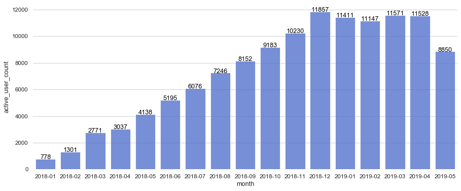
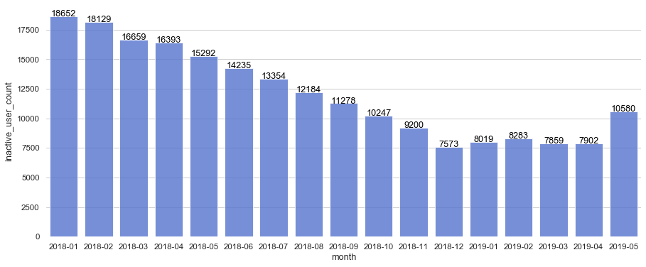
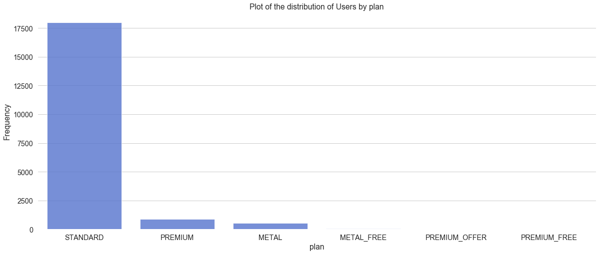
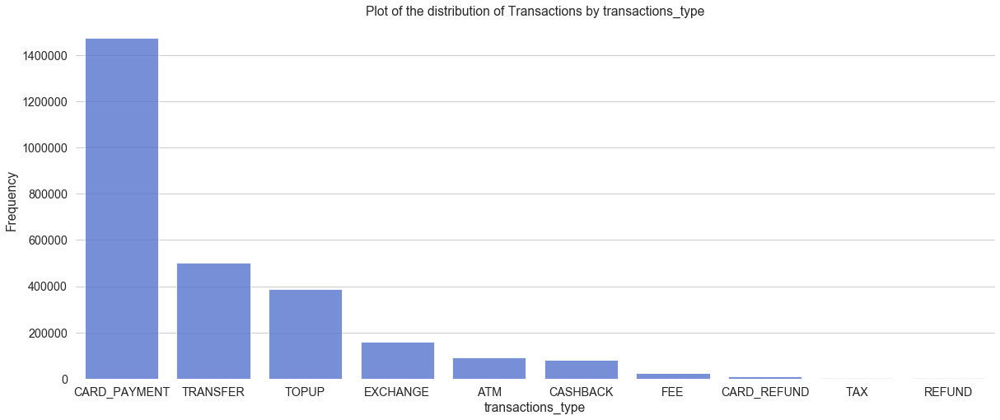
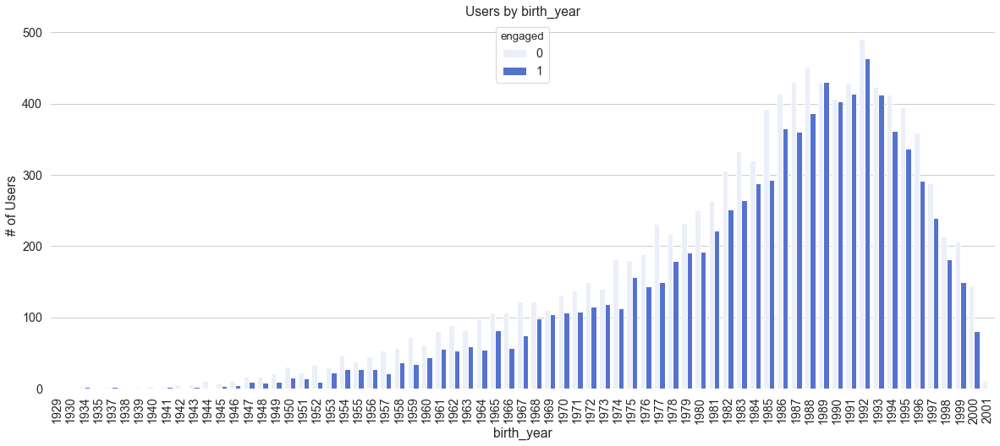
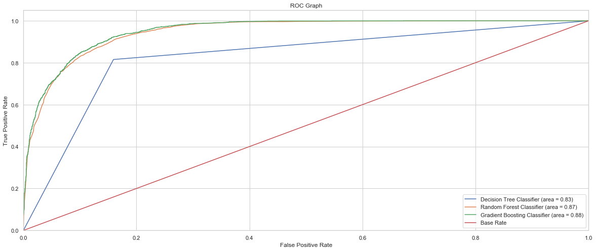
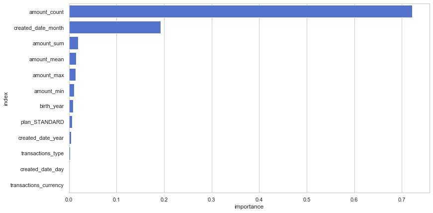

## Predicting user engagement
---
***Why is user engagement so important?***


User engagement is highly correlated with overall profitability. User attention is a finite resource and if users choose to spend their time on a particular app or site, they’re signaling that they find value in it. This allows businesses to make money from the product or service with ads, subscriptions, or sales. <br>
Source: https://mixpanel.com/topics/what-is-user-engagement/

Contents:
- Task Overview
- Data Overview
- Data Acquisition & Processing
- Exploratory Analysis
- Feature Engineering & Selection
- Model Selection & Performance
- Take-Aways

### Task Overview
---
The Head of Growth of a FinTech company called GemStones, has hired you as a data scientist to help the team out by predicting which of the users exhibit potential risk to become unengaged and churn.

**Goal**:

- Define a target metric to measure user engagement
- Build a machine learning model to predict user engagement using the target metric
- Provide guidance on how the team should reduce churn
- Describe a test method to know if the implementation is really reducing churn
- Describe how will you measure the impact of the solution on the business revenue?

**Potential Interested Parties**:
- Growth and Business development leadership
- Product leadership
- Datascience leadership

**Data Source**:
- CSV files of User activitities and product data

### Data Overview
---
Data sources made available by GemStones.

**Users data:** 19,430 rows and 11 columns 
- id                                 
- birth_year                                  
- country                                     
- city                                        
- created_date                                                   
etc..

**Transactions data:** 2,740,075 rows and 12 columns
- id
- type
- currency
- amount	
etc..


### Data Processing
---

**Process used:**

The check for missing values showed that there was 1 categorical column with missing values. The datasets were in good conditions without much cleaning effort needed.

>**Define a target metric to measure user engagement.**

GemStones' innovative solutions are better alternatives to bank accounts, they are convenient and easy to use.
The business goal of every company is to have growth and be profitable via the services it offers to customers. A business organization like GemStones has this as a goal. To realize it, GemStones is keenly concerned with customer engagement and churn, these components of the business go a long way in determining the overall success of the company.

In understanding customer engagement via behaviour, the following are likely questions that the business needs to answer with data:
- What gets our users to come back to our product?
- What do our users do when they are engaged with and are interested in our product?
- What are the actions that provide our users repeat value?
- How often does it make sense for our users to take those actions? Daily? Weekly? Monthly? or Once in a long while?

Actions taken on the GemStones app can be collected into the following list regarding “engagement”, these are click events on the various products e.g.

- Clicking on Money Transfers menu items(add money, exchange, details, send)
- Scrolling the transaction history view of the Money Transfers product.

a lot more customer clicks and scroll events can be captured and analysed from other GemStones products like:

- Send and Request Payments
- My Vault
- Budgeting
- Donations
- etc..

In the context of the datasets provided for this analysis, the target metric to measure user engagement can be defined as: <br>`The total number of unique active users in a month '(Monthly Active Users (MAU))'`

Who is an engaged and unengaged user?<br>
An engaged user can be defined as a user that carries out transactions(activities) via any of the listed GemStones products above in a month.
An unengaged user can be defined as a user that does not carry out any transaction in a month.

>**Plot of monthly active users**
 

>**Plot of monthly inactive users**


The plot of monthly active users shows a steady rise in the number of monthly active users. The steady month on month rise could be due to a new feature or new product launch to an existing user base.
Observations show a correlation between both plots, this further speaks to the monthly active user rise.
A noticeable step difference which is higher than previous bar differences can be observed between 2018-11 and 2018-12, this sharp increase was likely triggered by festivity, the range 2018-11 to 2018-12 is largely filled with various Christmas season activities like vacationing, shopping and parties.
The monthly active user metric is good to use in measuring user engagement

### Exploratory Analysis
---
Before going into modeling I carried out exploratory data anaylsis on the various attributes of the dataset to aid in having a better understand of the datasets and how they relate to each other.

>**Plot of the distribution of users by country**

Great Britain has the highest number of users, this could be because GemStones started from GB and has a strong presence there. Looking at the plot, gradual advancement are being made into other countries, the numbers will increase with the execution of targeted marketing campaigns. From the user birth year plot above, the bulk of the user base are between 1979 - 2000, they are largely young individuals, there is a possibility that over 80% of them use Facebook. Facebook has almost 2.5 billion monthly active users as of the fourth quarter of 2019. Facebook's AD services could be used to target "look alike customers" there by improving growth and user engagement.

>**Plot of the distribution of users by plan**

The Standard plan is the highest here, I believe this is so because it is free £0/m, and has a enough features to keep users. We could personalize the value of the premium plan and upsell to the customers on the standard plan, or we could get the profiles of the users in the premium plan and use the Facebook AD services to target "look alike customers" 

>**Plot of the distribution of transactions by transaction type**

Card Payment is the highest here, this is likely because users carry out day to day transactions like paying for goods services more than other transaction types.

>**Plot of the distribution of transactions by currency**

The top 2 currencies in use here are the EUR and GBP.

>**Plot of the distribution of user birth year by engagement**
 
From the distribution of users by birth year, the inactivity observed spans across every age group represented. (1 = Engaged, 0 = Unengaged)


>**Build a machine learning model to predict user engagement using the target metric**


### Feature Engineering & Selection
---
**Feature Engineering performed:**
- Decompose datetime attributes into components
- Aggregate attribute values into count, min, max, count, avg
- Label definition
- Labeling
- Missing value treatment
- Categorical attribute transformation

**Feature Selection:**
- The sklearn.feature_selection package was used
- 10 features got selected out of 22 features:
    - birth_year
    - amount_count
    - amount_max
    - created_date_month
    - created_date_year
    - etc...

### Modelling & Performance
---
**Model process:**
- Prepared a master dataset
- Train-Test-Split of Dataset
- Evaluation
- Tune parameters using GridSearchCV

Used a set of machine learning classifiers for the baseline algorithm evaluation these are DecisionTreeClassifier, RandomForestClassifier and GradientBoostingClassifier.

The output of the classifier models are shown below:

Model | f1-score(train_cv) | f1-score(test) | roc_auc_score
------------ | ----| ----------- | -------- |
DecisionTreeClassifier|79.1% | 81.0% |83% |
RandomForestClassifier|85.1%| 85.7% |87% |
GradientBoostingClassifier|85.8%| 86.4% |88% |

>**Plot of AUC ROC**

From the plot, the GradientBoostingClassifier performs better than other classifiers. Tuning parameters using GridSearchCV will aid in increasing the score.

>**Plot of feature importance**

The top 2 predictors from the list of attributes are `amount_count` and `created_date_month`. Engineering more features will aid in increasing the perfomance of the model. 

### Take-Aways
---
**Observation:**
The most important feature `amount_count` is largely influenced by the users with birth year range between  1982 - 1997, that reside in Great Britain, who have subscribed to the GemStones Standard plan and carry out a lot of card payment transactions using EUR or GBP as transaction currencies.


**Next steps:**
- Experiment with XGBoost and Artificial neural networks(ANN) in improving desired outcome
- Enrich model with additional data like datasets of:
    - Public holidays
    - Country/city weather temperatures


```python

```
